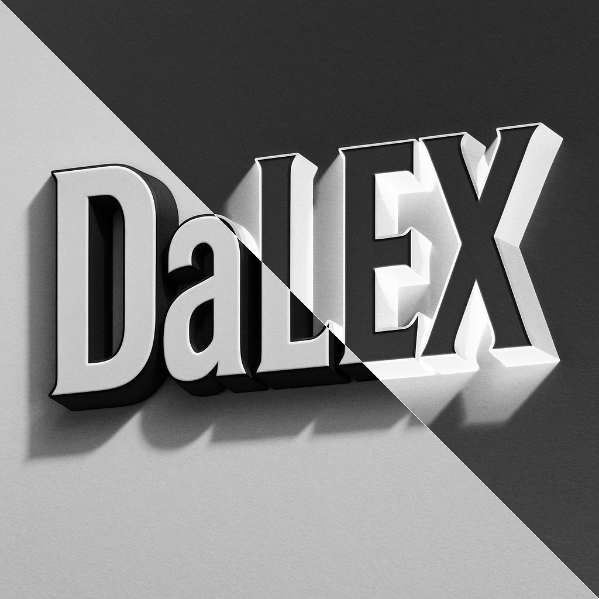
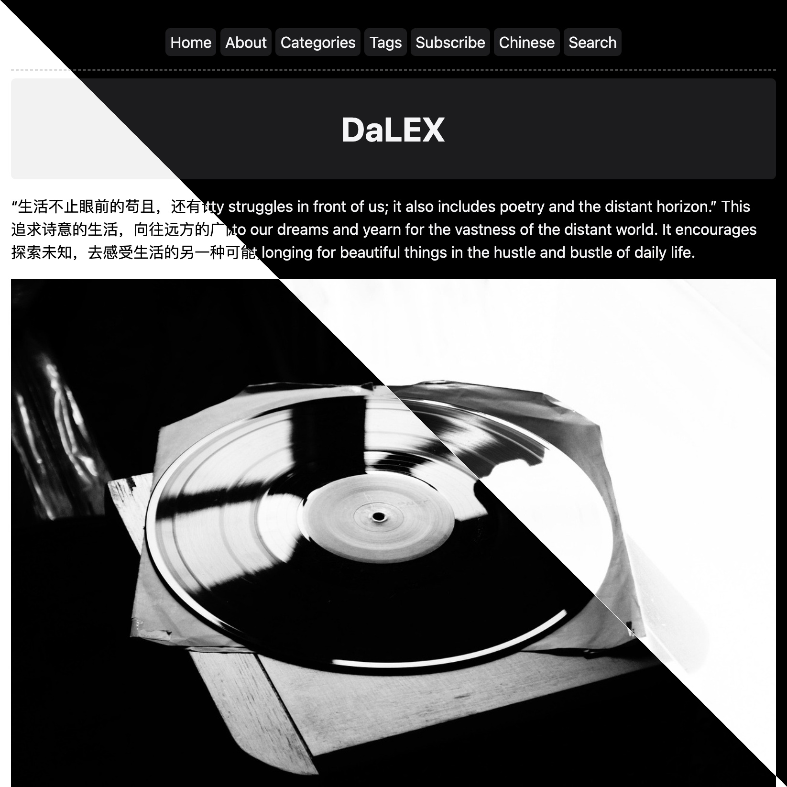
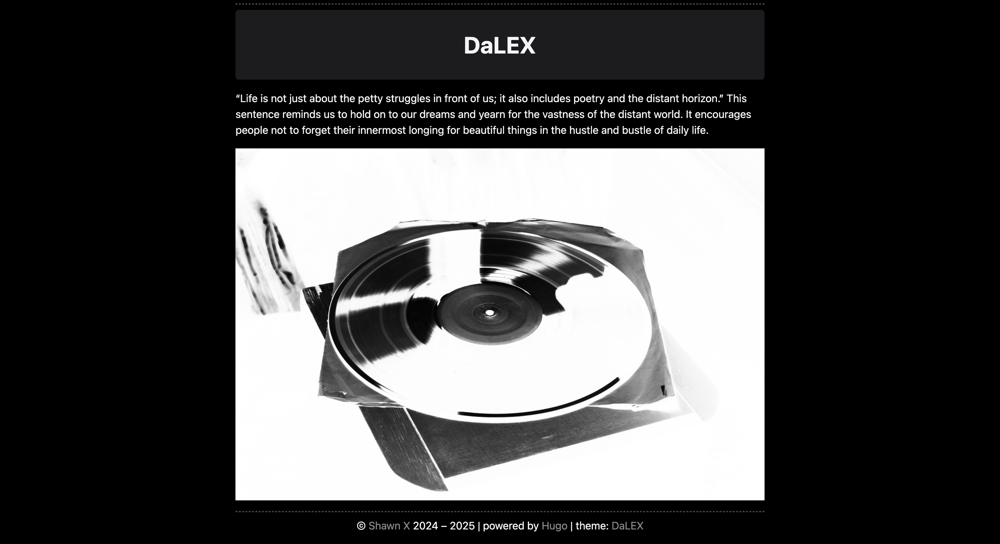
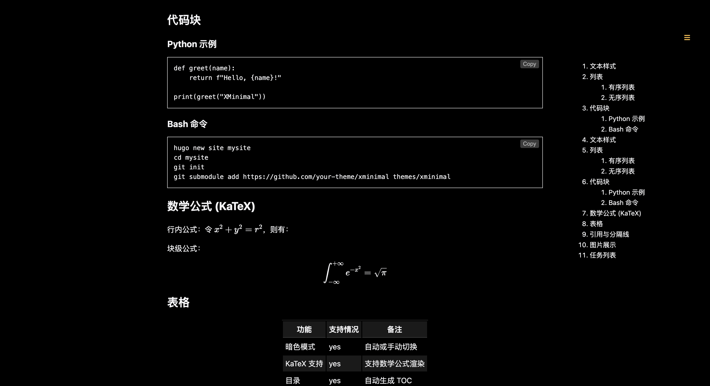
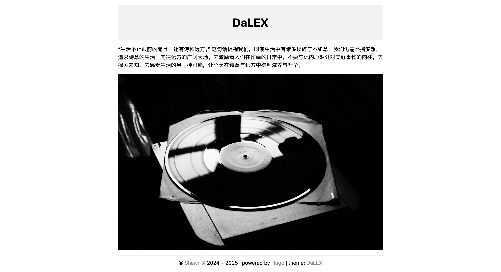
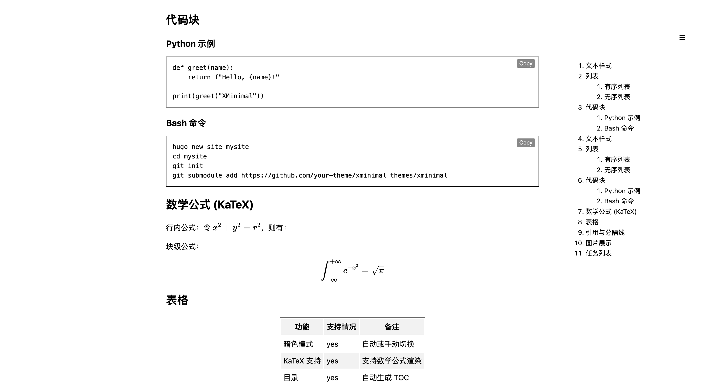
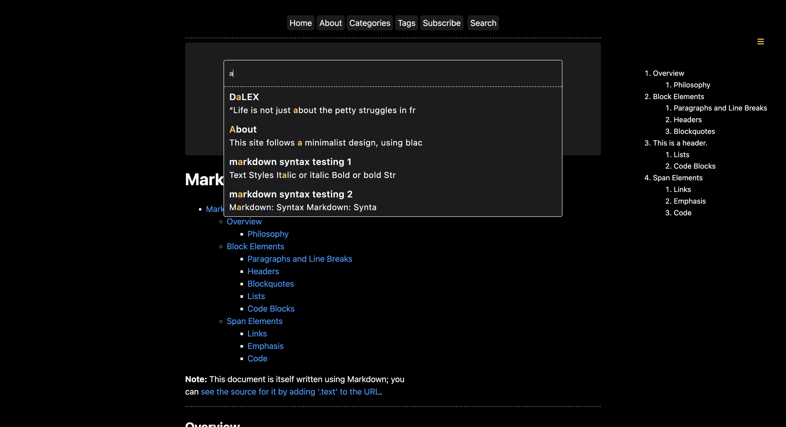
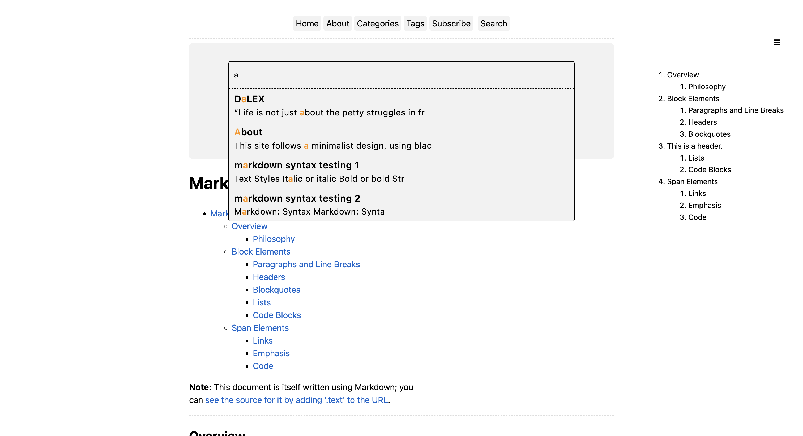

[简体中文](https://github.com/Shawn-Summer/hugo-theme-DaLEX/blob/main/readme_zh.md) | [English](https://github.com/Shawn-Summer/hugo-theme-DaLEX/blob/main/readme.md)
# Hugo Theme DaLEX

[](https://github.com/Shawn-Summer/hugo-theme-DaLEX/actions/workflows/gh-pages.yml)
[](https://github.com/Shawn-Summer/hugo-theme-DaLEX/blob/main/LICENSE)
[](https://github.com/Shawn-Summer/hugo-theme-DaLEX/stargazers)
[](https://github.com/Shawn-Summer/hugo-theme-DaLEX/commits/main)


<p align="center">
  <a href="https://github.com/Shawn-Summer/hugo-theme-DaLEX">
    
  </a>
</p>

**D**ark **a**nd **L**ight **EX**treme (DaLEX) is a minimalist theme designed for [Hugo](https://gohugo.io/), emphasizing clear typography and an extremely simple style. It supports light/dark mode, KaTeX mathematical formulas, local search, table of contents navigation, and multilingual switching. Example website: [demo](https://shawn-summer.github.io/hugo-theme-DaLEX/).



## ✨ Features

- 🌓 Switch between dark and light modes
- 📝 Clear and readable typography
- 📚 Table of Contents
- 🔍 Local search support
- 🌐 Multilingual switching
- 📐 KaTeX mathematical formula rendering
- ⚡ Fast loading and streamlined code
- 🎨 Easy to customize

## 🚀 Quick Start

Create a blog with the theme of DaLEX from scratch:

```bash
hugo new site mysite
cd mysite
rm -rf hugo.toml
git init
git submodule add https://github.com/Shawn-Summer/hugo-theme-DaLEX.git themes/DaLEX
cp -a  themes/DaLEX/exampleSite/. content/
mv content/hugo.yaml .
hugo server
```

## 🚂 Theme Switching

```yaml
params:
  mode: "auto"  # theme mode: light, dark, or auto
```

- Dark mode:




- Light mode:




When `mode: "auto"`, the theme will automatically adjust according to the browser's theme.

## 📦 KaTeX Formula Rendering

Enable KaTeX:

```yaml
params:
  enableKatex = true
```

## 🔎 Table of Contents and Search

```yaml
params:
  toc: true # whether to add table of contents
  fastsearch: true # whether to enable search bar
```




## 📜 License

Licensed under the MIT License, feel free to use and modify.